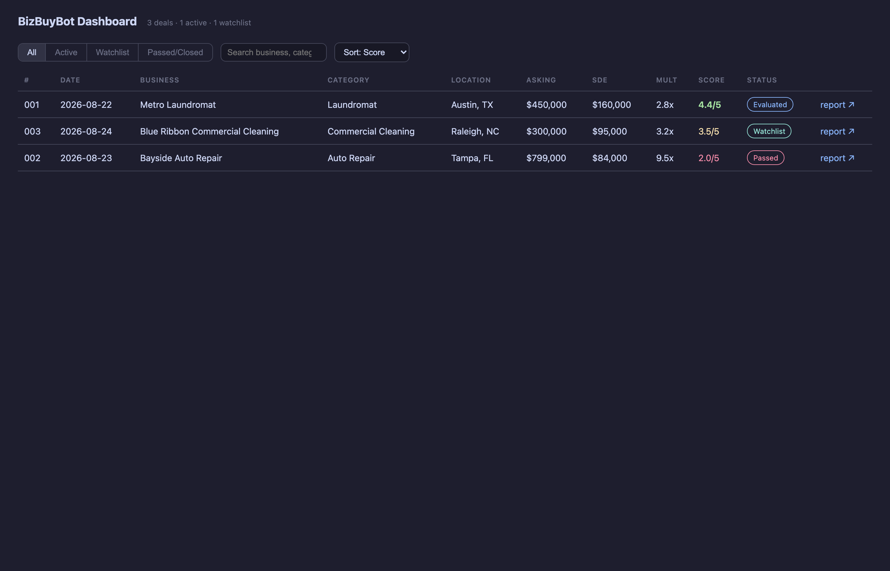
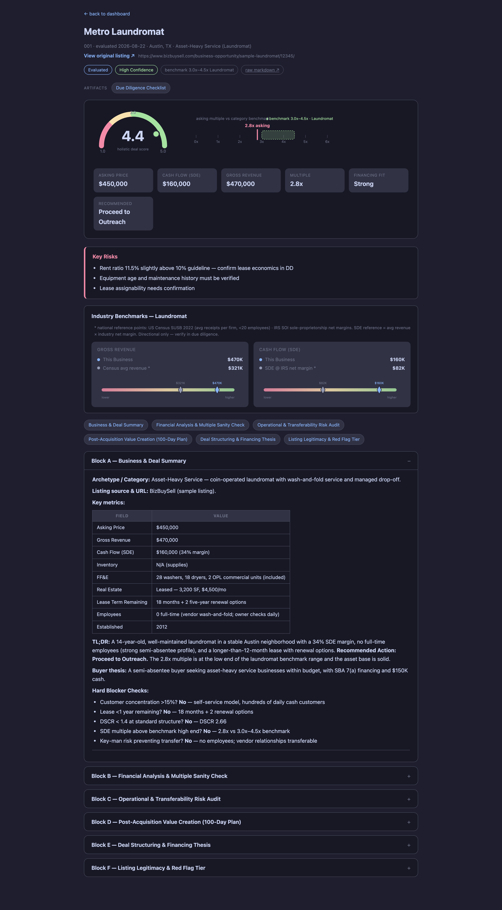
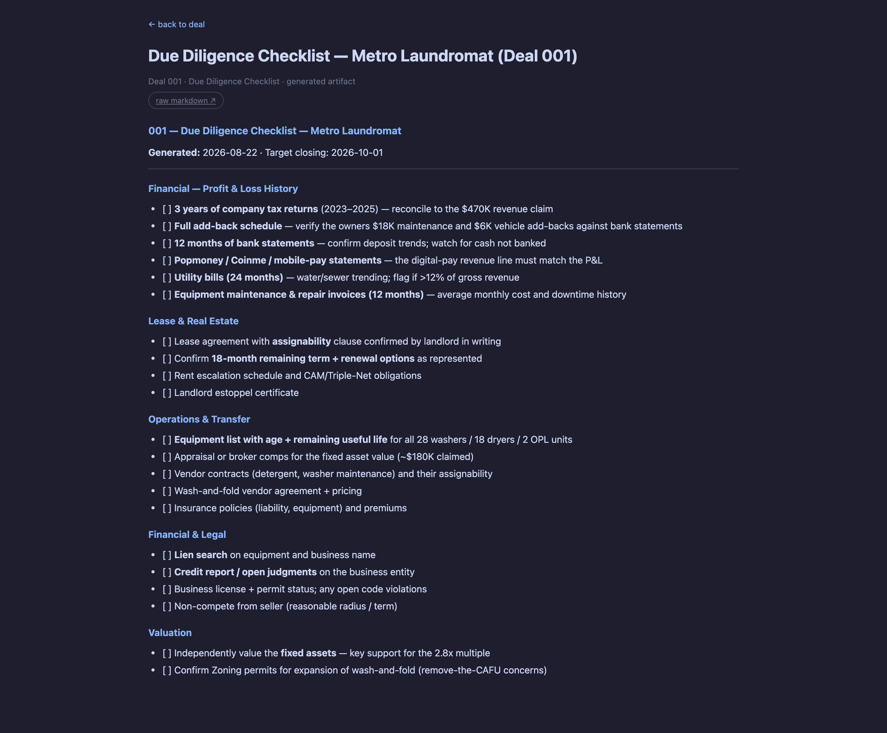

<p align="center">
  
</p>

<p align="center">
  <strong>Evaluate small-business listings. Generate due-diligence checklists, outreach drafts, and LOIs. Track the deal pipeline — all from your AI coding CLI.</strong>
</p>

<p align="center">
  <a href="https://opensource.org/licenses/MIT"></a>
  
  
  
</p>

---

Buying a small Main Street business — a laundromat, an HVAC/plumbing contractor, a commercial cleaning company — starts with hundreds of listings, and most of them aren't worth your time. BizBuyBot turns your AI coding CLI into a buying-side command center: it scans the marketplaces, evaluates listings into an easy-to-read report with a 1.0–5.0 score, drafts the documents you'll need to act, and keeps every deal in one auditable pipeline.

**Important: this isn't a "spray and pray" tool.** BizBuyBot is a filter. It helps you find the handful of listings worth pursuing out of a batch, and it drafts the paperwork — the decisions and the actions (offers, outreach, submission) are always yours.

---

## Features

| Feature | What it does |
|---|---|
| **Auto-Pipeline** | Paste a listing URL or text — get a full evaluation and a tracker entry in one step |
| **A-F Evaluation** | Five scoring dimensions plus a holistic 1.0–5.0 score, with a clear written report you can act on |
| **Industry Benchmarks** | SDE-multiple ranges per business category; calibrate to your own metro and state |
| **Due-Diligence Checklists** | A tailored checklist per deal — financials, lease, employees, valuation |
| **Broker / Seller Outreach** | Initial inquiry email drafts, focused on the gaps in each listing |
| **Letter of Intent** | Customized LOI drafts from the evaluated deal |
| **Portal Scanner** | Scrape BizBuySell / BizQuest automatically, with filtering and dedup |
| **Browser Dashboard** | Visualize and manage your pipeline, with every report and draft one click away |
| **Pipeline Integrity** | You never hand-edit records — data is written by safe, repeatable tools, so your pipeline stays auditable |
| **Human-in-the-Loop** | BizBuyBot evaluates and drafts. It **never** submits, sends, or commits anything for you. You decide and act |

---

## Quick Start

### Prerequisites

- **Node.js 18+**
- An AI coding CLI that supports agent skills (OpenCode, Claude Code, Codex, Copilot, ...) — you run BizBuyBot from inside it
- `npx playwright install chromium` — only if you want the **scan** feature

### Install

```bash
git clone https://github.com/evan-100/bizbuybot.git
cd bizbuybot
npm install
npm run doctor     # verifies everything is ready
```

### First Steps

Start your AI CLI in this folder and initialize your profile once:

```
/bizbuybot setup      # interactive interview → buyer profile, search criteria, thesis
```

The interview writes your personal config for you — no file editing needed. Repo ships with **fictional sample data**, so the dashboard and tracker work immediately. Then you're ready:

```
/bizbuybot                  → menu + pipeline summary
/bizbuybot <URL or text>    → full auto-pipeline (evaluate + track in one step)
/bizbuybot dashboard        → open the browser dashboard  (or: npm run dashboard)
```

### Commands

| Command | Action |
|---|---|
| `/bizbuybot` | Show the interactive menu and pipeline summary |
| `/bizbuybot <URL or text>` | Run auto-pipeline (fetch → evaluate → track) |
| `/bizbuybot setup` | Set up or edit your buyer profile |
| `/bizbuybot scan` | Scrape BizBuySell/BizQuest for deals matching your criteria |
| `/bizbuybot loi <id>` | Generate a customized Letter of Intent |
| `/bizbuybot dd <id>` | Generate a tailored Due Diligence Checklist |
| `/bizbuybot outreach <id>` | Generate a broker/seller inquiry draft |
| `/bizbuybot tracker` | Summarize current pipeline metrics |
| `/bizbuybot dashboard` | Open the browser dashboard |
| `/bizbuybot export` | Export your pipeline data |

### Behind the scenes

BizBuyBot keeps your data safe with a few simple command-line tools — add deals, change statuses, verify the pipeline, export, scan marketplaces, check setup health, and calibrate benchmarks. Quality is enforced by automated tests and a pipeline-integrity check that run on every change.

---

## Screenshots

| Pipeline dashboard | Deal report | Due-diligence checklist |
|---|---|---|
|  |  |  |

*Rendered from the included sample data.*

---

## How It Works

Each command maps to a set of instructions (evaluation rubric, checklist template, LOI drafting) that your CLI follows step by step. Safe, repeatable scripts are the only thing that writes to your pipeline — so your records stay clean and auditable.

BizBuyBot also keeps a strict separation between:

- **The system** — the evaluation logic, templates, and tools. Version-controlled, and you don't need to touch it.
- **Your data** — your profile, catchment criteria, and deal records. Personal, and preserved across updates.

Read [`DATA_CONTRACT.md`](DATA_CONTRACT.md) for the full contract, and [`AGENTS.md`](AGENTS.md) for precise AI instructions.

---

## Methodology Notes

- **SDE multiples** come from industry rules-of-thumb (marketplace history, SBA lending norms) — directional, not absolute.
- **Local bench options** — you can calibrate metro revenue and state margins to your own buying area for more relevant comparisons.
- **Source transparency** — every report is written so you can see exactly how the score and the multiple were reached.

---

## License

Distributed under the [MIT License](LICENSE). This project is not affiliated with BizBuySell or BizQuest. It is intended for evaluating publicly listed businesses only.

---

<p align="center"><small>BizBuyBot evaluates and drafts. You decide and act.</small></p>